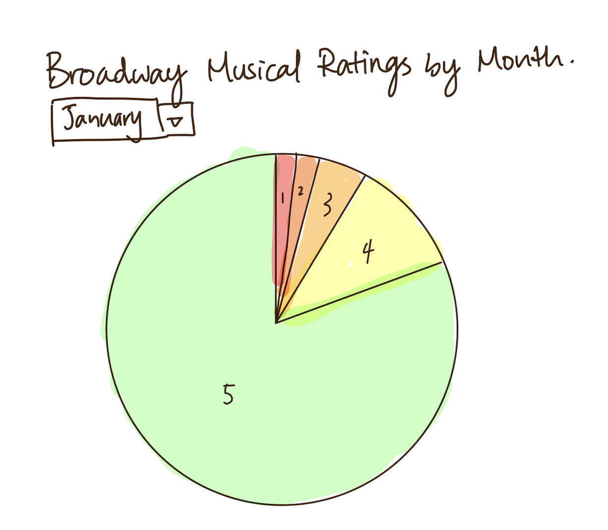

# Original Data Visualization

(From NYC Data Science Academy at https://nycdatascience.com/blog/student-works/a-travellers-guide-to-broadway-musicals-from-travellers-perspective/)

## Data Critique

This data visualization is in the article "A Traveler's Guide to Broadway Musicals", and it is used by the author to show that although the numbers of reviews has changed, the ratings of broadway musicals did not change much within the different months of the year 2017-2018. 

At the first glance, I didn't quite get what this visualization is telling. After reading the title and looking at the descriptions for a while, I got what the designer wants to show. I like the fact that the designer is using a simple design for it (there are no useless information), however, the visualization could be easily misinterpreted and there are several changes that I wanted to make on the design:

- The colors used overall are too similar and could be modified. Currently, the designer used a proportional bar graph with a gray color for the rating 5 and a darker gray for the rating 4, but the colors is not clear and distict enough to make the audience pay attention to it (the color did not stand out from the gray background). 
- The title is not telling enough information to the viewers. For me, "Rating vs. Month" could be modified to be more clear to the audience about the graph. 
- There are five elements on the stacked bar graph, which would be difficult for the audience to interpret. Therefore, I want to change the type of this visualization. 

# Sketches of Redesign

## First Sketch

With the modifications in my mind, I created my first sketch. 

In this sketch, I changed visualization to a line graph with the idea that lines might display the change of ratings over the change of time better. However, I realized that because there is not an interaction between I also changed the color of the data visualization to a more distinct palette. This way, the viewers can track the changes of the ratings more clearly. I also changed the title of the visualization to "Broadway Musical Ratings by Month", by giving more information, the audience can have a better understanding of the context. 

## Second Sketch 

After thinking through the drawbacks, I created another sketch using 12 pie charts because I think that pie chart is the best way to compare categorical data. For the colors, I used green for the rating 5, red for rating 1, and colors in between them to create a gradient. I choose the colors because I think a rating of 5 is the best rating and green is a more positive color. Red, on the other hand, is mostly used as a negative color so I used it for rating 1. 

However, 12 similar pie charts might confuse the audience as there is not much change between the different months and it probably don't make a lot of sense at the first glance. Later, I realized that I can create one with a slider on top so that there are not too many pie charts presented looking identical. From there, I got my third sketch. 

## Third Sketch

# User Feedback

I have interviewed two people about my sketches:

- Student, female, 22
- Adult, female, 57

The responses are:

- Can you tell me what you think this is? What this is telling you?

Student: This is a pie chart of Broadway musical ratings by month. It is telling me that in the title. This is also telling me that a lot of people rated 5 on Broaway shows, and only a small portion gave poor ratings. 

Adult: I didn't read the title at first, but I guessed it is some sort of rating. And after reading the title, I know this is talking about Broadway. I didn't get the "by month part" at first, but I realized there is a bar at the top where I can switch the months. 

- Is there anything you find surprising or confusing?

Student: I really like how you made the graph a little bit interactive because we get to change the month and look at the differences. 

Adult: I think your progress from sketch 1 to sketch 3 is great because the first two are a little confusing and I can easily get what you are trying to tell in the third one. I like the colors you used, I think it is within context and fresh. I have never looked at a graph that changes over time, I think that is cool. 

- Who do you think is the intended audience for this?

Student: Since it is about Broadway, I would say the intended audience is anyone that go on this site to visit, probably Broadway lovers. 

Adult: I think the intended audience is anyone that have access to this website. (It's a public website) Okay, than the intended audience is the public. 

- Is there anything you would change or do differently?

Student: I think you can add a legend of the different colors you used. I think that would be helpful. Other than that, I think you are doing great. 

Adult: I think you did a good job and I cannot think of anything that you can change. I think if you have a data set that changed a lot between the months your visualization will look better. 

From The responses During data critique in class on Tuesday, 11/15, I got more feedbacks on my sketches. Overall, they think that my design is valid and commented that they think a pie chart is probably the best way that I can deal with this data set. However, they don't like the rainbow effect and the contrast between red and green as it is not friendly to colorblindness and think that I might need to rethink about the colors that I am using in my final design. Using this information, I was able to create my final design. 

# Final Design

I used a pie chart with time slider in Flourish for my final design of this data visualization. During the process of making the graphic, I realized that I need to modify my data so that each pie total up to 100 percent. After fixing the numbers in my dataset, I changed my color palette to less of a rainbow effect based on the feedbacks I got from my peers (I used blue rather than green think about color blindness and eliminated some orange shades to give less of a rainble effect), and I used a gray color for rating 1 and a less saturated color for rating 2. I also created a legend on my visualization from the feedback of my friend. On the title, I added the year of this data source just to give the audience more information. Moreover, I changed the filter type from dropdown to time slider, I think it is more fun and it can play by itself. From this activity, I learned to think more about the audience's first reaction to the graphic and how different people might react differently towards my design. 

[Back to Portfolio](https://ziqi0921.github.io/zhou-portfolio/)

