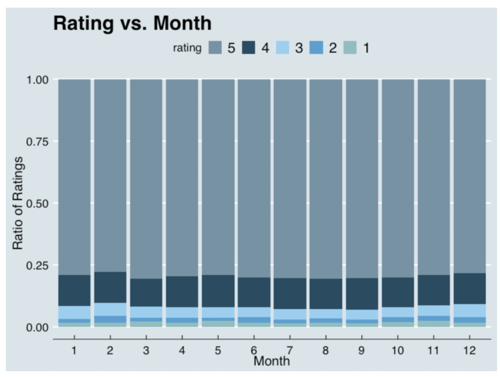
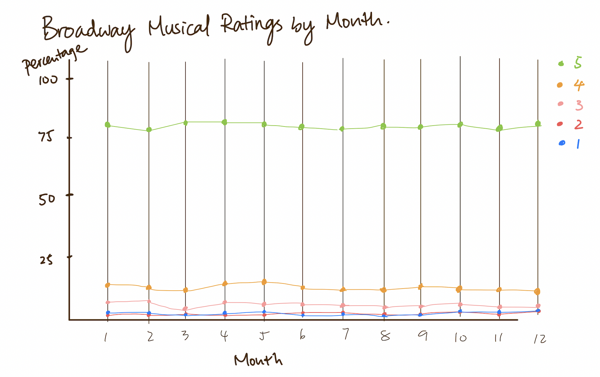
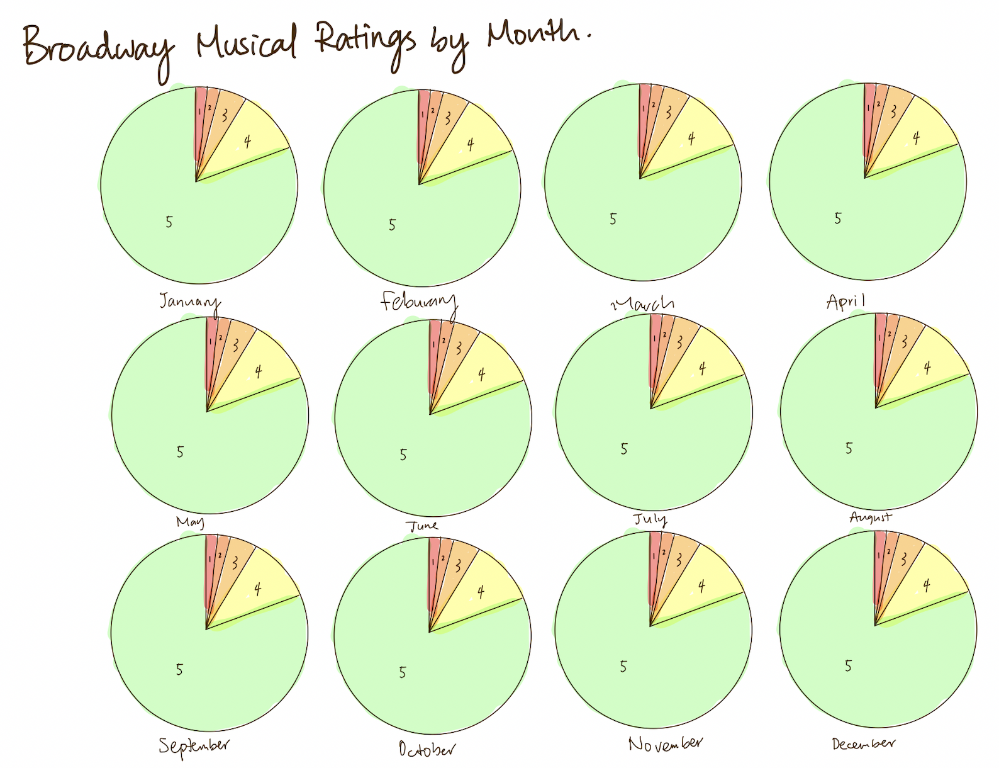

# Original Data Visualization

(From NYC Data Science Academy at https://nycdatascience.com/blog/student-works/a-travellers-guide-to-broadway-musicals-from-travellers-perspective/)

## Data Critique

This data visualization is in the article "A Traveler's Guide to Broadway Musicals", and it is used by the author to show that although the numbers of reviews has changed, the ratings of broadway musicals did not change much within the different months of the year 2017-2018. 

At the first glance, I didn't quite get what this visualization is telling. After reading the title and looking at the descriptions for a while, I got what the designer wants to show. I like the fact that the designer is using a simple design for it (there are no useless information), however, the visualization could be easily misinterpreted and there are several changes that I wanted to make on the design:

- The colors used overall are too similar and could be modified. Currently, the designer used a proportional bar graph with a gray color for the rating 5 and a darker gray for the rating 4, but the colors is not clear and distict enough to make the audience pay attention to it. 
- The title is not telling enough information to the viewers. For me, "Rating vs. Month" could be modified to be more clear to the audience about the graph. 
- There are five elements on the stacked bar graph, which would be difficult for the audience to interpret. 

# Sketches of Redesign

With the modifications in my mind, I created my first sketch. 

In this sketch, I changed visualization to a line graph with the idea that lines might display the change of ratings over the change of time better. However, I realized that because there is not an interaction between I also changed the color of the data visualization to a more distinct palette. This way, the viewers can track the changes of the 

After thinking through the drawbacks, I created another sketch using 12 pie charts because I think that pie chart is the best way to compare categorical data. 

# User Feedback

I have interviewed two people about my sketches:

- Student, female, 22
- Adult, female, 57

The responses are:

The first person liked my second sketch better because they like how 

From The responses During data critique in class on Tuesday, 11/15, I got more feedbacks on my sketches. Overall, they think that my design is valid. However, they don't like the contrast between red and green as it is not  effect and think that I might need to rethink about the colors that I am using in my final design. Using this information, I was able to create my final design. 

# Final Design

I used a pie chart with time slider in Flourish for my final design of this data visualization. During the process, I realized that I need to modify my data so that each pie total up to 100 percent. Moreover, I changed my color palette to less of a rainbow effect based on the feedbacks I got from my peers. 

[Back to Portfolio](https://ziqi0921.github.io/zhou-portfolio/)

