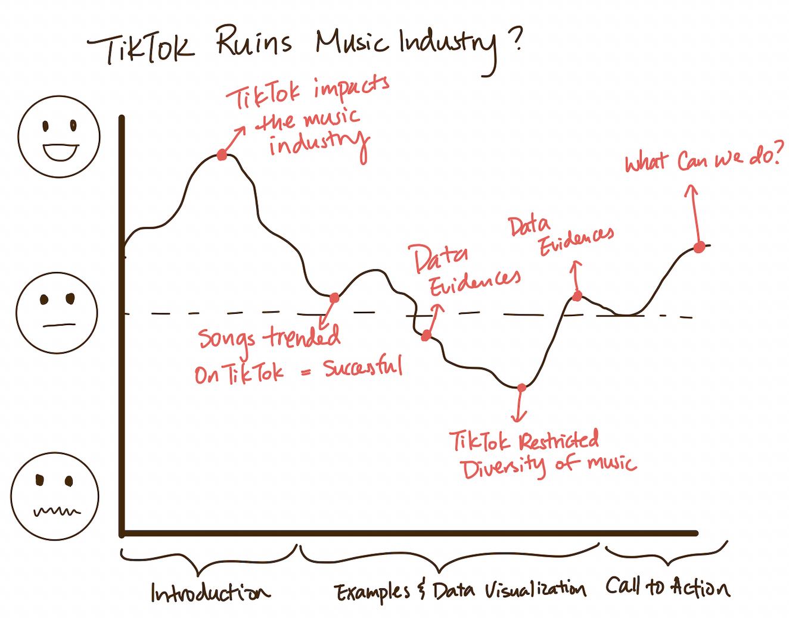

# Part I: Final Project

## Outline

The story I will focus on in this project is the impact TikTok has had on the music industry, highlight some negative consequences of these changes, and provide a call-to-action to the audiences. Lil Nas X, born in 1999, dropped out after one year of college to work in restaurants and playgrounds. In 2019, he dominated the Billboard chart with "Old Town Road" and won a Grammy Award, and quickly became a hot new star in the music industry within a few months. There are many similar examples on TikTok as it only takes 15 seconds to give countless people a chance to become famous. More importantly, TikTok is directly linked to streaming media playback, mainstream music charts, record company invitations, offline performances, etc. Every part of the music industry is being influenced by TikTok. 

Next, I wanted to show that TikTok is profoundly affecting the creators, streamers, record companies, and listeners. Based recent news, many well-known singers have openly complained on TikTok on social media, stating that record companies and Agent companies are now desperate for TikTok, arranging the release of songs by platform hotspots and trends and give them quantitive indicators on creating TikTok contents. According to the [TikTok 2021 Report](https://newsroom.tiktok.com/en-us/year-on-tiktok-music-report-2021), over 175 songs that trended on TikTok ended up charting on the Billboard Hot 100. TikTok becomes more than just business, but also aesthetics and tastes. From this, I will use data visualizations to showcase how many songs popular on TikTok overlap with the Billboard Hot 100 and Spotify's top list and how the overlap changes in recent few years. 

According to statistics from [Quartz](https://qz.com/1519823/is-spotify-making-songs-shorter), from 2013 to 2018, the average length of the Billboard Hot 100 hits dropped by 20 seconds, and the emergence of TikTok has greatly accelerated this trend. Moreover, there are singers who customize TikTok songs based on platform trends and memes, such as Canadian rapper Tiagz, who draws inspiration from almost all of his songs from existing memes on the platform. After sampling and mixing, he mass-produces songs, and there is always something to hit. In such a fast-paced update, many creators are short-lived on TikTok and to some extent, there is a lack of diversity of the trending songs on TikTok as the homogenization of such songs becomes more serious. I will use data to show the characteristics that is common among popular TikTok songs and how it compare to the characteristics of the Billboard Hot 100 songs overtime. For example, comparing the "dancability", duration, BPM, and "loudness" of a song and see if there is a trend. 

In the end, I will state that music aesthetics should be diverse and should not be bound by unified rules and regulations and ask the question "will TikTok kill the artistry of musical compositions by clicks and algorithms?" It is undeniable that TikTok is playing an increasingly pivotal role in the music industry and the cooperation between major labels, record companies and TikTok is deepening as they are communicating closely for maximizing commercial interests. 

This will target more towards younger generations, TikTok users and music lovers as well as the general public. Here is the story arc:

## Sketches

## Data

These are the datasets I am planning to use:

- TikTok Popular Songs 2019 from [Kaggle](https://www.kaggle.com/datasets/sveta151/tiktok-popular-songs-2019)
- TikTok Popular Songs 2021 from [Kaggle](https://www.kaggle.com/datasets/sveta151/tiktok-popular-songs-2021)
- TikTok Popular Songs 2022 from [Kaggle](https://www.kaggle.com/datasets/sveta151/tiktok-popular-songs-2022?resource=download)
- Billboard Hot 100 from [Data World](https://data.world/kcmillersean/billboard-hot-100-1958-2017)
- Billboard "The Hot 100" Songs from [Kaggle](https://www.kaggle.com/datasets/dhruvildave/billboard-the-hot-100-songs)
- Top Spotify Songs 2010-2019 from [Kaggle](https://www.kaggle.com/datasets/leonardopena/top-spotify-songs-from-20102019-by-year)

The TikTok 2019 and 2022 dataset contains basic information of the popular TikTok songs in the two years such as track name and artist name. I can use these two datasets to compare and contrast the music tastes of the audiences on TikTok and see if there is a trend because they are collected using the exact same factors. The Billboard Hot 100 data from Data.World contains every weekly Hot 100 singles chart from Billboard from 1958 to 2017 and their music genres. The Kaggle dataset of Billbpard has more recent data, which can fill the gap from 2017 to 2021. The Spotify dataset contains all the top streamed songs from 2010 to 2019. 

First of all, I will merge the datasets from the same music platform together. I will compare the popular songs on TikTok with the top songs streamed on Spotify and Billboard Hot 100 to see whether the platforms share similar songs. An increase in the percentage of TikTok songs charting on Billboard or Spotify indicates that the platform becomes more popular and is more important in music consumption. It can back up the point that music labels are paying more attention to the success of a song on TikTok. 

I choose these datasets because all of them share common characteristic factors: "dancability", "energy", "liveliness", "loudness" and "duration". Therefore, I can compare and contrast each characteristic of the songs and see if the trend changes over time. For example, since TikTok is all about short videos, a shorter duration of a song can be a characteristic that is influenced by TikTok. Also, if more popular songs on TikTok are high in dancability, a higher dancability trend in the Billboard Hot 100 can also showcase some influence of TikTok. If there are significant changes or trend in these TikTok related factors, it is a stong indicator that TikTok is impacting the diversity of music produced and consumed in the industry. 

## Method and Medium

This project will be completed using Shorthand to make the web more engaging and interactive to the audience. All the data visualizations will be done using Tableau and Florish and link to Shorthand to back up the story. There will be two versions of Shorthand created: one with detail on all the stories, data visualizations, and examples and another condensed version for in-class presentation. 

[Back to Portfolio](https://ziqi0921.github.io/zhou-portfolio/)
